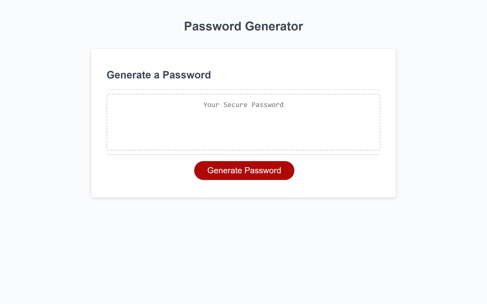

# pwdgenerator

## Description
This repo contains an application that can be used to randomly generate a password, based on a selection of options.These options include the length of the password and a choice of uppercase, lowercase, numeric and special characters.  The app runs in the browser, and features dynamically updated HTML and CSS powered by JavaScript code. It has a clean and polished user interface that is responsive and adapts to multiple screen sizes.

Topics covered include HTML, CSS, Javascript, variables, functions, arrays, obects and methods.

## Instructions

1. Click on the following link to access the password generator: https://russkinori.github.io/pwdgenerator/.

The following image shows the web application's appearance:

.

2. Once the application has loaded, click on the **Generate Password** button which will display a pop up window above. Read the question and follow the instruction (_Please note that you will not be able to proceed if your entry does not meet the criteria specified_).
  
3. A series of options will follow asking for the type of characters that you would like in your password. Select **OK** for **Yes** or select **Cancel** for **No**. 
 
4. The password will be then be displayed on the screen, replacing the text **Your Secure Password**.
 

These steps portraying the functionality of the application can be seen below.
.

5. To generate another password, repeat steps 2 and 3.

## Credits 
Materials used to facilitate the learning experience is listed below:
 - https://youtu.be/95mIis5M-gU
 - https://www.markdowntutorial.com/
 - https://developer.mozilla.org/en-US/docs/Web/API

## Licence
Licenced under [MIT](./LICENSE).

